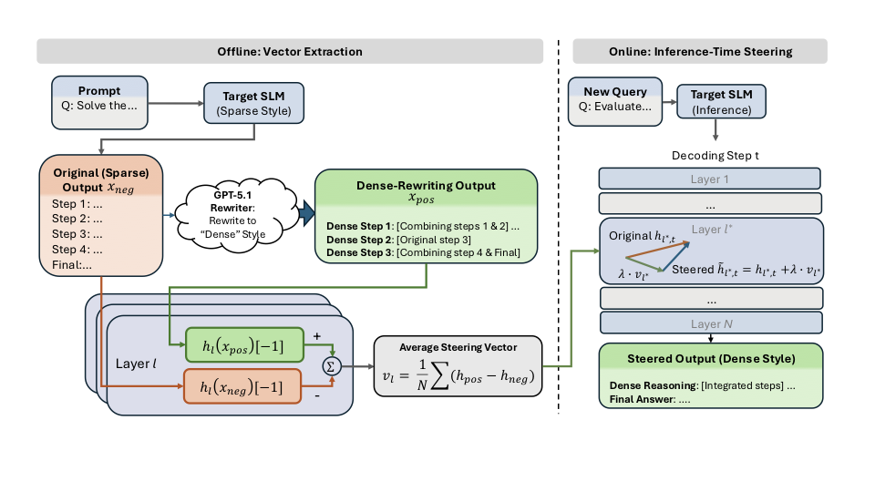

<div align="center">

# DenseSteer: Steering Small Language Models towards Dense Math Reasoning

[paper link](http://arxiv.org/abs/2605.29247) | [project](https://github.com/oyy2000/DenseSteer)



</div>

## Overview

DenseSteer is a lightweight pipeline for rewriting math solutions into denser reasoning traces, extracting steering vectors from contrastive positive/negative responses, and evaluating their effect with `lm-evaluation-harness`.

> Note: the arXiv link above is a temporary placeholder and should be replaced with the official paper link when available.

## Pipeline

1. Rewrite correct model solutions into denser positive responses.
2. Build contrastive pairs from dense and baseline responses.
3. Extract layer-wise steering vectors from the contrastive pairs.
4. Sweep steering layers and strengths during evaluation.
5. Compare results with the custom `steer_hf` model interface in `lm-evaluation-harness`.

## Project Structure

* `00_rewrite.py`: Rewrites baseline model outputs into denser positive responses.
* `01_extract_vectors.py`: Extracts activation differences between desired and baseline responses.
* `02_apply_vectors.py`: Automates evaluation across multiple layers and steering strengths.
* `vectors/`: Contains reference steering vectors used in the paper.
* `imgs/`: Contains the main method figure and supporting visual assets.

## Setup

Install the local evaluation harness and steering-vector dependency:

```bash
cd lm-evaluation-harness
pip install -e .
pip install torch transformers tqdm steering-vectors
```

## Usage

### Step 0: Rewrite Dense Responses

Prepare an input JSON file with correct model outputs. Each sample should include a question under `doc.question` or `question`, plus a baseline response under `resp_before`.

Modify the configuration variables in `00_rewrite.py`:

```python
REWRITER_MODEL = "Qwen/Qwen2.5-7B-Instruct"
INPUT_FILE = Path("data/rewritten.json")
OUTPUT_FILE = Path("rewrites_out/dense_rewritten.json")
MAX_SAMPLES = 100
```

Then run:

```bash
python 00_rewrite.py
```

The script writes `resp_after` as the dense rewrite and also exports `pos_response` / `neg_response` fields for the vector extraction step.

### Step 1: Extract Steering Vectors

Modify `DATA_FILE` in `01_extract_vectors.py` to point to the rewritten contrastive dataset, for example `rewrites_out/dense_rewritten.json`, then run:

```bash
python 01_extract_vectors.py
```

This generates `steering_vector.pt` under `./vectors_out`.

### Step 2: Evaluate

Modify `LAYERS`, `LAMBDAS`, `TASKS`, and `LIMIT` in `02_apply_vectors.py` to define your experimental grid, then run:

```bash
python 02_apply_vectors.py
```

The script calls `lm_eval` with the custom `steer_hf` model class, which applies the selected steering vector during evaluation.

## Acknowledgements

This repository is built upon [lm-evaluation-harness](https://github.com/EleutherAI/lm-evaluation-harness) and [steering-vectors](https://github.com/steering-vectors/steering-vectors). We thank all contributors for their support.
